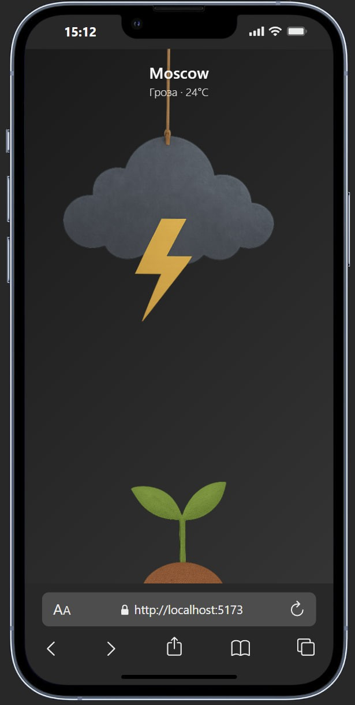
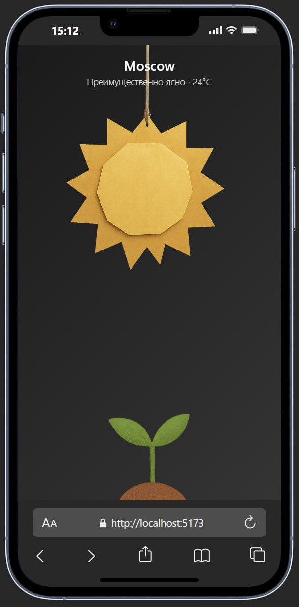
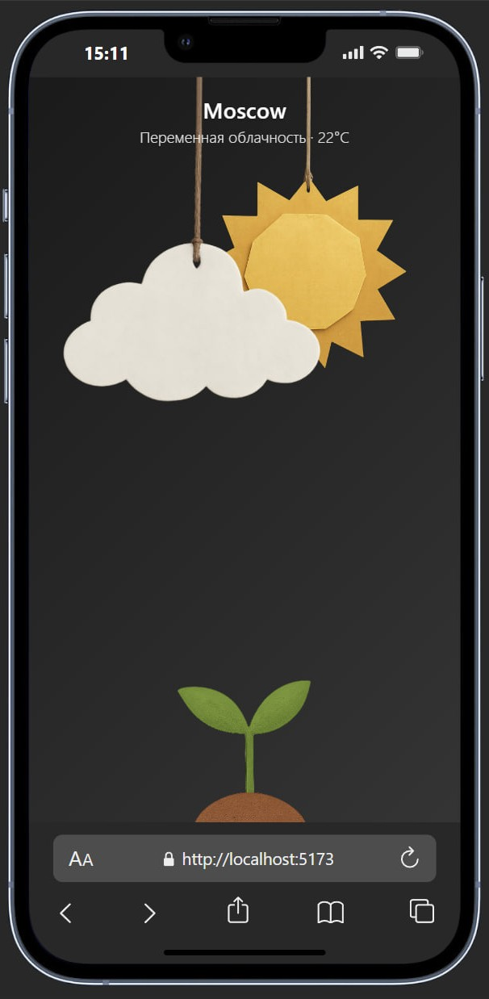

  
  
  

🌱 App Description

MeteoBloom is a new kind of weather app where the forecast turns into a little game.
Weather is no longer just numbers — it’s a tiny living world on your screen:

☀️ Sun, clouds, storms, and other weather events appear as cute hanging paper figures.
🌱 A little sprout grows at the bottom and reacts to the changing climate.
🎮 You can move the sun and clouds yourself — and watch how the plant and the world respond.
🌦️ The real weather in your city sets the mood and triggers unique events.

It’s not just a forecast — it’s a relaxing mini-game for your everyday life. Each day brings new combinations and small surprises.

